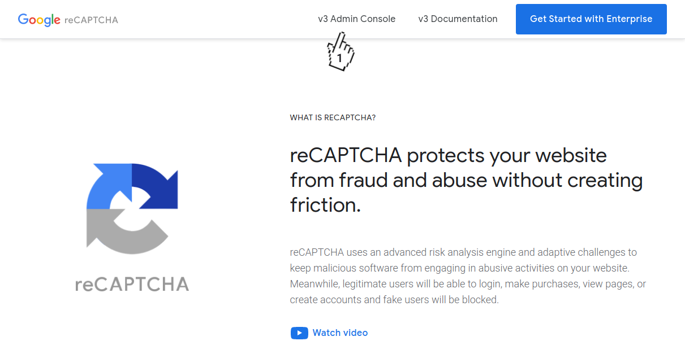
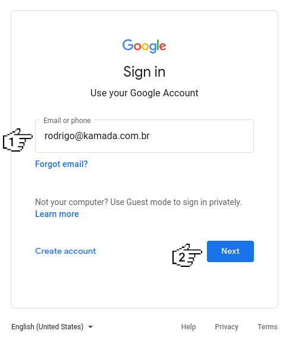
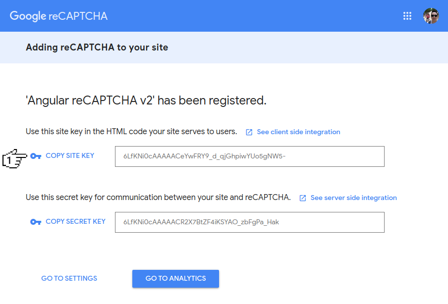
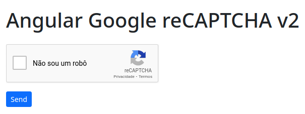

# Angular Google reCAPTCHA v2


Application example built with [Angular](https://angular.io/) 14 and adding the Google reCAPTCHA v2 using the [ng-recaptcha](https://www.npmjs.com/package/ng-recaptcha) library.

This tutorial was posted on my [blog](https://rodrigo.kamada.com.br/blog/adicionando-o-componente-google-recaptcha-v2-em-uma-aplicacao-angular) in portuguese and on the [DEV Community](https://dev.to/rodrigokamada/adding-the-google-recaptcha-v2-to-an-angular-application-1o7o) in english.


[](https://rodrigo.kamada.com.br)
[](https://www.linkedin.com/in/rodrigokamada)
[](https://twitter.com/rodrigokamada)
[](https://www.instagram.com/rodrigokamada)


## Prerequisites


Before you start, you need to install and configure the tools:

* [git](https://git-scm.com/)
* [Node.js and npm](https://nodejs.org/)
* [Angular CLI](https://angular.io/cli)
* IDE (e.g. [Visual Studio Code](https://code.visualstudio.com/))


## Getting started


### Create and configure the account on the Google reCAPTCHA


**1.** Let's create the account. Access the site [https://www.google.com/recaptcha/](https://www.google.com/recaptcha/) and click on the button *v3 Admin Console*.



**2.** Fill in the field *Email or phone* and click on the button *Next* to login with your Google account and if you don't have an account, just create a new account.



**3.** Fill in the field *Label*, click on the option *reCAPTCHA v2*, Fill in the field *Domains*, click on the checkbox *Accept the reCAPTCHA Terms of Service* and click on the button *Submit*.


**4.** Click on the button *COPY SITE KEY* to copy the key, in my case, the key `6LfKNi0cAAAAACeYwFRY9_d_qjGhpiwYUo5gNW5-` was copied because this key will be configured in the Angular application.



**5.** Ready! The keys have been generated.


### Create the Angular application


**1.** Let's create the application with the Angular base structure using the `@angular/cli` with the route file and the SCSS style format.

```shell
ng new angular-recaptcha-v2
? Would you like to add Angular routing? Yes
? Which stylesheet format would you like to use? SCSS   [ https://sass-lang.com/documentation/syntax#scss                ]
CREATE angular-recaptcha-v2/README.md (1064 bytes)
CREATE angular-recaptcha-v2/.editorconfig (274 bytes)
CREATE angular-recaptcha-v2/.gitignore (604 bytes)
CREATE angular-recaptcha-v2/angular.json (3291 bytes)
CREATE angular-recaptcha-v2/package.json (1082 bytes)
CREATE angular-recaptcha-v2/tsconfig.json (783 bytes)
CREATE angular-recaptcha-v2/.browserslistrc (703 bytes)
CREATE angular-recaptcha-v2/karma.conf.js (1437 bytes)
CREATE angular-recaptcha-v2/tsconfig.app.json (287 bytes)
CREATE angular-recaptcha-v2/tsconfig.spec.json (333 bytes)
CREATE angular-recaptcha-v2/src/favicon.ico (948 bytes)
CREATE angular-recaptcha-v2/src/index.html (304 bytes)
CREATE angular-recaptcha-v2/src/main.ts (372 bytes)
CREATE angular-recaptcha-v2/src/polyfills.ts (2820 bytes)
CREATE angular-recaptcha-v2/src/styles.scss (80 bytes)
CREATE angular-recaptcha-v2/src/test.ts (788 bytes)
CREATE angular-recaptcha-v2/src/assets/.gitkeep (0 bytes)
CREATE angular-recaptcha-v2/src/environments/environment.prod.ts (51 bytes)
CREATE angular-recaptcha-v2/src/environments/environment.ts (658 bytes)
CREATE angular-recaptcha-v2/src/app/app-routing.module.ts (245 bytes)
CREATE angular-recaptcha-v2/src/app/app.module.ts (393 bytes)
CREATE angular-recaptcha-v2/src/app/app.component.scss (0 bytes)
CREATE angular-recaptcha-v2/src/app/app.component.html (24617 bytes)
CREATE angular-recaptcha-v2/src/app/app.component.spec.ts (1115 bytes)
CREATE angular-recaptcha-v2/src/app/app.component.ts (225 bytes)
✔ Packages installed successfully.
```

**2.** Install and configure the Bootstrap CSS framework. Do steps 2 and 3 of the post *[Adding the Bootstrap CSS framework to an Angular application](https://github.com/rodrigokamada/angular-bootstrap)*.

**3.** Configure the `siteKey` variable with the Google reCAPTCHA key in the `src/environments/environment.ts` and `src/environments/environment.prod.ts` files as below.

```typescript
recaptcha: {
  siteKey: '6LfKNi0cAAAAACeYwFRY9_d_qjGhpiwYUo5gNW5-',
},
```

**4.** Install the `ng-recaptcha` library.

```shell
npm install ng-recaptcha
```

**5.** Import the `FormsModule`, `RecaptchaFormsModule`, `RecaptchaModule` modules. Configure the Google reCAPTCHA key. Change the `app.module.ts` file and add the lines as below.

```typescript
import { FormsModule } from '@angular/forms';
import { RECAPTCHA_SETTINGS, RecaptchaFormsModule, RecaptchaModule, RecaptchaSettings } from 'ng-recaptcha';

import { environment } from '../environments/environment';

imports: [
  BrowserModule,
  FormsModule,
  AppRoutingModule,
  RecaptchaModule,
  RecaptchaFormsModule,
],
providers: [
  {
    provide: RECAPTCHA_SETTINGS,
    useValue: {
      siteKey: environment.recaptcha.siteKey,
    } as RecaptchaSettings,
  },
],
```

**6.** Remove the contents of the `AppComponent` class from the `src/app/app.component.ts` file. Import the `NgForm` component and create the `send` method as below.

```typescript
import { Component } from '@angular/core';
import { NgForm } from '@angular/forms';

@Component({
  selector: 'app-root',
  templateUrl: './app.component.html',
  styleUrls: ['./app.component.scss'],
})
export class AppComponent {

  token: string|undefined;

  constructor() {
    this.token = undefined;
  }

  public send(form: NgForm): void {
    if (form.invalid) {
      for (const control of Object.keys(form.controls)) {
        form.controls[control].markAsTouched();
      }
      return;
    }

    console.debug(`Token [${this.token}] generated`);
  }

}
```

**7.** Remove the contents of the `src/app/app.component.html` file. Add the `re-captcha` component as below.

```html
<div class="container-fluid py-3">
  <h1>Angular reCAPTCHA v2</h1>

  <form #form="ngForm">
    <div class="row mt-3">
      <div class="col-sm-12 mb-2">
        <re-captcha id="recaptcha" name="recaptcha" #recaptcha="ngModel" [(ngModel)]="token" required [class.is-invalid]="recaptcha.invalid && (recaptcha.dirty || recaptcha.touched)"></re-captcha>
        <div *ngIf="recaptcha.invalid && (recaptcha.dirty || recaptcha.touched)" class="invalid-feedback">
          <div *ngIf="recaptcha.errors?.['required']">This field is required.</div>
        </div>
      </div>
    </div>
    <div class="row">
      <div class="col-sm-12 mb-2">
        <button type="button" class="btn btn-sm btn-primary" (click)="send(form)">Send</button>
      </div>
    </div>
  </form>
</div>
```

**8.** Add the style in the `src/app/app.component.scss` file as below.

```css
re-captcha.is-invalid > div {
  border: 1px solid #dc3545 !important;
  border-radius: 0.2rem;
}
```

**9.** Run the application with the command below.

```shell
npm start

> angular-recaptcha-v2@0.0.0 start
> ng serve

✔ Browser application bundle generation complete.

Initial Chunk Files | Names         |      Size
vendor.js           | vendor        |   2.73 MB
styles.css          | styles        | 266.58 kB
polyfills.js        | polyfills     | 128.52 kB
scripts.js          | scripts       |  76.67 kB
main.js             | main          |  15.54 kB
runtime.js          | runtime       |   6.64 kB

                    | Initial Total |   3.21 MB

Build at: 2021-08-28T12:35:07.166Z - Hash: 0612b9d911a0acdf2b42 - Time: 10102ms

** Angular Live Development Server is listening on localhost:4200, open your browser on http://localhost:4200/ **


✔ Compiled successfully.
```

**10.** Ready! Access the URL `http://localhost:4200/` and check if the application is working. See the application working on [GitHub Pages](https://rodrigokamada.github.io/angular-recaptcha-v2/) and [Stackblitz](https://stackblitz.com/edit/angular14-recaptcha-v2).




## Cloning the application

**1.** Clone the repository.

```shell
git clone git@github.com:rodrigokamada/angular-recaptcha-v2.git
```

**2.** Install the dependencies.

```shell
npm ci
```

**3.** Run the application.

```shell
npm start
```
